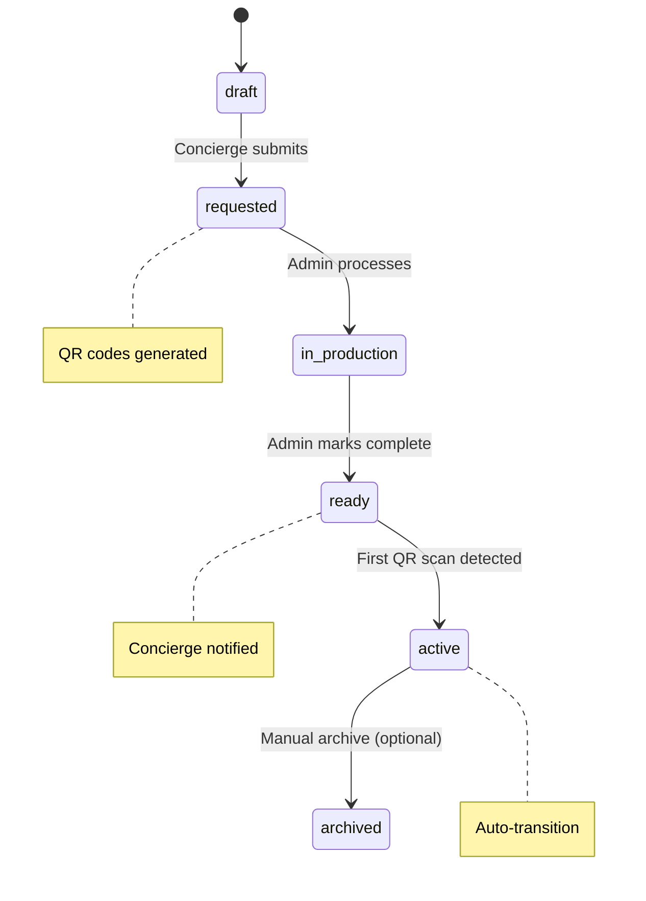

# PRIMA – Touchpoint Requisition System
## Functional Specification v1.0

*Last updated: 31 July 2025*

## 1. Purpose

Extend Prima's existing QR concierge dashboard to include touchpoint requisition functionality, allowing concierges to request physical QR touchpoints directly through their dashboard interface, with full admin workflow management and automatic integration into Prima's existing QR code system.

## 2. Scope

### In Scope
- **Concierge Portal**: Touchpoint request interface within existing QrConciergeDashboard
- **Requisition Data Model**: New TouchpointRequest model integrated with existing QrCode system
- **Admin Management**: Filament admin interface for requisition queue management
- **Status Lifecycle**: Draft → Requested → In Production → Ready → Active workflow
- **Notifications**: Email/Slack integration using existing notification infrastructure
- **QR Integration**: Automatic QR code generation using existing Prima QR system

### Out of Scope
- Manufacturing/shipping logistics (handled externally)
- Advanced analytics dashboards (handled by existing QR analytics)
- Payment processing for requisitions

## 3. Actors & Roles

| Actor | Description | Prima Role | Key Permissions |
|-------|-------------|------------|-----------------|
| **QR Concierge** | Hotel staff with QR concierge access | `concierge` + `is_qr_concierge=true` | Create requests, view own requests |
| **Prima Admin** | Internal operations team | `super_admin` | Manage global requisition queue, update statuses |
| **Production Team** | External print/assembly (optional) | External | Receive production notifications |

## 4. Current Prima Foundation

### ✅ Existing Components
- **QrConciergeDashboard**: `/app/Filament/Pages/QrConcierge/QrConciergeDashboard.php`
- **QR Code System**: Complete QR generation, assignment, and tracking
- **Concierge Model**: `is_qr_concierge` flag and `revenue_percentage` fields
- **Admin Interface**: QrCodeResource for QR management
- **Notifications**: Laravel notification system with email/SMS/Slack channels
- **Authentication**: Role-based access with concierge permissions

### 🔄 Extensions Needed
- TouchpointRequest model and admin interface
- Requisition workflow within QrConciergeDashboard
- Status tracking and notification triggers

## 5. Touchpoint Requisition Flow

### 5.1 Concierge Request Flow
1. **Login** → Existing QrConciergeDashboard
2. **Navigate** → "Request Touchpoints" tab/section
3. **Create Request**:
   - **Name**: Touchpoint identifier (max 80 chars)
   - **Location**: Placement location (max 120 chars) 
   - **Quantity**: Number needed (1-999)
   - **Notes**: Optional additional details
4. **Save Draft** → Status = `draft`
5. **Submit Request** → Status = `requested`, QR codes generated
6. **Track Status** → Real-time updates in dashboard

### 5.2 Admin Processing Flow
1. **Admin Queue** → `/admin/touchpoint-requests` Filament resource
2. **Review Request** → View concierge, location, quantity
3. **Update Status**:
   - `in_production` → Send to manufacturing
   - `ready` → Notify concierge, provide QR downloads
4. **Auto-Activation** → First scan sets status = `active`

## 6. Status Lifecycle



## 7. Data Model

### 7.1 TouchpointRequest Model
**File**: `app/Models/TouchpointRequest.php`

**Migration**: `create_touchpoint_requests_table.php`
```php
<?php

use Illuminate\Database\Migrations\Migration;
use Illuminate\Database\Schema\Blueprint;
use Illuminate\Support\Facades\Schema;

return new class extends Migration
{
    public function up(): void
    {
        Schema::create('touchpoint_requests', function (Blueprint $table) {
            $table->id();
            $table->foreignId('concierge_id')->constrained();
            $table->string('name', 80);
            $table->string('location', 120);
            $table->integer('quantity')->unsigned();
            $table->text('notes')->nullable();
            $table->enum('status', ['draft', 'requested', 'in_production', 'ready', 'active', 'archived'])
                  ->default('draft');
            $table->timestamp('requested_at')->nullable();
            $table->timestamp('production_started_at')->nullable();
            $table->timestamp('ready_at')->nullable();
            $table->timestamp('first_scan_at')->nullable();
            $table->foreignId('processed_by')->nullable()->constrained('users');
            $table->timestamps();
            
            $table->index(['concierge_id', 'status']);
            $table->index(['status', 'requested_at']);
        });
    }

    public function down(): void
    {
        Schema::dropIfExists('touchpoint_requests');
    }
};
```

### 7.2 Integration with QR Codes
**Migration**: `add_touchpoint_request_id_to_qr_codes_table.php`

```php
<?php

use Illuminate\Database\Migrations\Migration;
use Illuminate\Database\Schema\Blueprint;
use Illuminate\Support\Facades\Schema;

return new class extends Migration
{
    public function up(): void
    {
        Schema::table('qr_codes', function (Blueprint $table) {
            $table->foreignId('touchpoint_request_id')->nullable()
                  ->constrained()->onDelete('set null');
        });
    }

    public function down(): void
    {
        Schema::table('qr_codes', function (Blueprint $table) {
            $table->dropForeign(['touchpoint_request_id']);
            $table->dropColumn('touchpoint_request_id');
        });
    }
};
```

### 7.3 Status History Tracking
**File**: `app/Models/TouchpointRequestStatusHistory.php`

**Migration**: `create_touchpoint_request_status_history_table.php`
```php
<?php

use Illuminate\Database\Migrations\Migration;
use Illuminate\Database\Schema\Blueprint;
use Illuminate\Support\Facades\Schema;

return new class extends Migration
{
    public function up(): void
    {
        Schema::create('touchpoint_request_status_history', function (Blueprint $table) {
            $table->id();
            $table->foreignId('touchpoint_request_id')->constrained()->onDelete('cascade');
            $table->string('from_status')->nullable();
            $table->string('to_status');
            $table->foreignId('changed_by')->nullable()->constrained('users');
            $table->text('notes')->nullable();
            $table->timestamp('created_at');
            
            $table->index(['touchpoint_request_id', 'created_at']);
        });
    }

    public function down(): void
    {
        Schema::dropIfExists('touchpoint_request_status_history');
    }
};
```

## 8. UI/UX Implementation

### 8.1 QrConciergeDashboard Enhancement
**File**: `app/Filament/Pages/QrConcierge/QrConciergeDashboard.php`

**New Tabs/Sections**:
- **"My Touchpoints"**: Existing QR performance table
- **"Request Touchpoints"**: New requisition interface
- **"Request History"**: Status tracking table

### 8.2 Touchpoint Request Form
**File**: `app/Livewire/QrConcierge/TouchpointRequestForm.php`

**Features**:
- **Form Fields**: Name, location, quantity, notes
- **Validation**: Real-time validation with Prima styling
- **Draft Saving**: Auto-save drafts every 30 seconds
- **Bulk Actions**: Multi-select drafts for batch submission
- **Preview**: Show estimated QR code layout

### 8.3 Request Status Widget
**File**: `app/Livewire/QrConcierge/TouchpointRequestStatusWidget.php`

**Display**:
- **Status Timeline**: Visual progress indicator
- **Request Summary**: Name, location, quantity, requested date
- **QR Download**: Available when status = `ready`
- **Performance Link**: Connect to QR analytics when `active`

## 9. Admin Interface

### 9.1 TouchpointRequestResource
**File**: `app/Filament/Resources/TouchpointRequestResource.php`

**Features**:
- **Global Queue**: All requests across concierges
- **Filtering**: By status, concierge, date range
- **Bulk Updates**: Multi-select status changes
- **QR Preview**: Generate and preview QR codes
- **Concierge Details**: Link to concierge profile
- **Export**: CSV download for production teams

**Table Columns**:
- Concierge (searchable, sortable)
- Request Name
- Location  
- Quantity
- Status Badge
- Requested Date
- Last Updated
- Actions (View, Update Status, Download QRs)

### 9.2 Status Update Actions
**File**: `app/Filament/Resources/TouchpointRequestResource/Actions`

**Available Actions**:
- **Generate QR Codes**: Create QR codes for approved requests
- **Mark In Production**: Transition with production notes
- **Mark Ready**: Trigger concierge notification
- **Bulk Status Update**: Process multiple requests
- **Download QR Package**: ZIP file with all QR codes + manifest

## 10. QR Code Integration

### 10.1 Automatic QR Generation
**File**: `app/Actions/TouchpointRequest/GenerateRequestQrCodes.php`

**Process**:
1. **Request Approved** → Status changes to `requested`
2. **Generate QR Codes** → Use existing `GenerateQrCodes` action
3. **Link Codes** → Set `touchpoint_request_id` on generated QR codes
4. **Set Properties**:
   - `name`: "{Request Name} - {Location} #{sequence}"
   - `notes`: "Generated for touchpoint request #{id}"
   - `concierge_id`: From request
   - `is_active`: true

### 10.2 QR Code Properties
**Enhanced Naming Convention**:
```php
// Example: "Hotel Lobby Stand - Main Entrance #1"
$qrName = "{$request->name} - {$request->location} #{$sequence}";
```

**Metadata Storage**:
```php
$qrMeta = [
    'touchpoint_request_id' => $request->id,
    'request_name' => $request->name,
    'location' => $request->location,
    'generated_at' => now(),
    'batch_sequence' => $sequence
];
```

## 11. API Endpoints

### 11.1 Concierge Endpoints
```php
// Concierge touchpoint requests
GET    /api/concierge/touchpoint-requests        // List own requests
POST   /api/concierge/touchpoint-requests        // Create new request
PUT    /api/concierge/touchpoint-requests/{id}   // Update draft
POST   /api/concierge/touchpoint-requests/{id}/submit // Submit request
```

### 11.2 Admin Endpoints  
```php
// Admin requisition management
GET    /api/admin/touchpoint-requests           // Global queue
PATCH  /api/admin/touchpoint-requests/{id}/status // Update status
POST   /api/admin/touchpoint-requests/{id}/generate-qrs // Generate QR codes
GET    /api/admin/touchpoint-requests/{id}/download // Download QR package
```

**Authentication**: Existing Laravel Sanctum with role-based permissions

## 12. Notifications

### 12.1 Notification Events
**File**: `app/Notifications/TouchpointRequest/`

| Event | Recipient | Channel | Template |
|-------|-----------|---------|----------|
| Request Submitted | Prima Admins | Slack #ops-requisitions | "{{concierge}} requested {{quantity}} touchpoints for {{location}}" |
| Status → In Production | Concierge | Email | Production started notification |
| Status → Ready | Concierge | Email + SMS | "Your {{name}} touchpoints are ready for pickup" |
| First Scan Detected | Concierge | Email | "Your {{name}} touchpoint is now active!" |

### 12.2 Slack Integration
**File**: `app/Notifications/TouchpointRequest/RequestSubmittedSlack.php`

**Message Format**:
```php
SlackMessage::create()
    ->to('#ops-requisitions')
    ->content("🏨 New Touchpoint Request")
    ->attachment(function ($attachment) use ($request) {
        $attachment->title($request->concierge->hotel_name ?? 'Unknown Hotel')
                  ->fields([
                      'Concierge' => $request->concierge->user->name,
                      'Location' => $request->location,
                      'Quantity' => $request->quantity,
                      'Requested' => $request->requested_at->format('M j, Y g:i A')
                  ]);
    });
```

## 13. Validation & Business Rules

### 13.1 Form Validation
```php
// TouchpointRequestForm validation rules
'name' => 'required|string|max:80',
'location' => 'required|string|max:120', 
'quantity' => 'required|integer|min:1|max:999',
'notes' => 'nullable|string|max:500'
```

### 13.2 Business Rules
- **Concierge Scoping**: Users can only see/edit their own requests
- **Status Progression**: Cannot skip status steps (draft → requested → production → ready → active)
- **QR Generation**: Only occurs on status change to `requested`
- **Duplicate Prevention**: Warn on similar name/location combinations
- **Archive Rules**: Only admins can archive; preserves historical data

### 13.3 Error Handling
- **Invalid Status Transition**: "Cannot change from {current} to {target}"
- **Missing QR Codes**: "Request must have generated QR codes before marking ready"
- **Permission Denied**: "You can only manage your own touchpoint requests"

## 14. Performance & Scalability

### 14.1 Database Optimization
- **Indexes**: Concierge + status, status + date for admin queries
- **Relationship Loading**: Eager load concierge and QR codes
- **Pagination**: 25 requests per page in admin interface

### 14.2 Caching Strategy
- **Request Counts**: Cache concierge request statistics (5 min TTL)
- **Status Badges**: Cache status distribution for admin dashboard
- **QR Generation**: Background job for large quantities (>50)

## 15. Testing Requirements

### 15.1 Feature Tests
```php
// TouchpointRequestTest.php
- testConciergeCanCreateRequest()
- testConciergeCannotSeeOtherRequests() 
- testAdminCanUpdateStatus()
- testQrCodesGeneratedOnApproval()
- testNotificationsSentOnStatusChange()
```

### 15.2 Permission Tests
```php
// TouchpointRequestPermissionTest.php
- testOnlyQrConciergesCanCreateRequests()
- testAdminsCanAccessGlobalQueue()
- testConciergesScopedToOwnRequests()
```

## 16. Deployment Plan

### 16.1 Database Migrations
**Commands:**
```bash
php artisan make:migration create_touchpoint_requests_table
php artisan make:migration create_touchpoint_request_status_history_table  
php artisan make:migration add_touchpoint_request_id_to_qr_codes_table
```

**Migration Code:** See Section 7 (Data Model) for complete migration implementations

### 16.2 Implementation Phases

**Phase 1 - Core Models & API** (Sprint 1)
- [ ] TouchpointRequest model and migrations
- [ ] Basic CRUD API endpoints
- [ ] Status transition logic
- [ ] QR code integration

**Phase 2 - Concierge Interface** (Sprint 2)  
- [ ] Extend QrConciergeDashboard with request functionality
- [ ] TouchpointRequestForm Livewire component
- [ ] Request status tracking widget
- [ ] Form validation and draft saving

**Phase 3 - Admin Interface** (Sprint 3)
- [ ] TouchpointRequestResource Filament admin
- [ ] Bulk operations and status management
- [ ] QR code generation and download
- [ ] Admin queue filtering and search

**Phase 4 - Notifications & Polish** (Sprint 4)
- [ ] Email and Slack notification system
- [ ] Status history tracking
- [ ] Performance optimization
- [ ] Testing and documentation

### 16.3 Rollout Strategy
1. **Feature Flag**: Enable for select QR concierges initially
2. **Admin Training**: Document new requisition queue workflow
3. **Concierge Communication**: Email announcement of new request feature
4. **Monitoring**: Track request volume and processing times

## 17. Success Metrics

### 17.1 Operational Metrics
- **Request Volume**: Track requests per concierge per month
- **Processing Time**: Time from requested → ready (target: ≤5 business days)
- **Fulfillment Rate**: % of requests that reach active status
- **Error Rate**: Failed status transitions or QR generation failures

### 17.2 User Experience Metrics
- **Form Completion**: % of started requests that get submitted
- **Dashboard Usage**: Time spent in touchpoint request section
- **Support Tickets**: Reduction in manual touchpoint request tickets

### 17.3 Business Metrics
- **Touchpoint Activation**: % of generated QR codes that receive scans
- **Revenue Attribution**: Booking revenue from requisitioned touchpoints
- **Concierge Satisfaction**: Survey feedback on request process

## 18. Security Considerations

### 18.1 Access Control
- **Role Verification**: Strict checking of `is_qr_concierge` flag
- **Data Scoping**: Concierges see only their own requests
- **Admin Permissions**: Restrict status updates to super_admin role

### 18.2 Input Validation
- **SQL Injection Prevention**: Use Laravel's query builder/Eloquent
- **XSS Protection**: Sanitize all user inputs
- **File Security**: Secure QR code download endpoints with signed URLs

### 18.3 Audit Trail
- **Status Changes**: Log all status transitions with user attribution
- **QR Generation**: Track who generated QR codes for which requests
- **Admin Actions**: Log all admin operations in status history

---

*This specification extends Prima's existing QR concierge infrastructure to provide a complete touchpoint requisition workflow, leveraging existing authentication, notification, and QR code systems while adding new request management capabilities.*